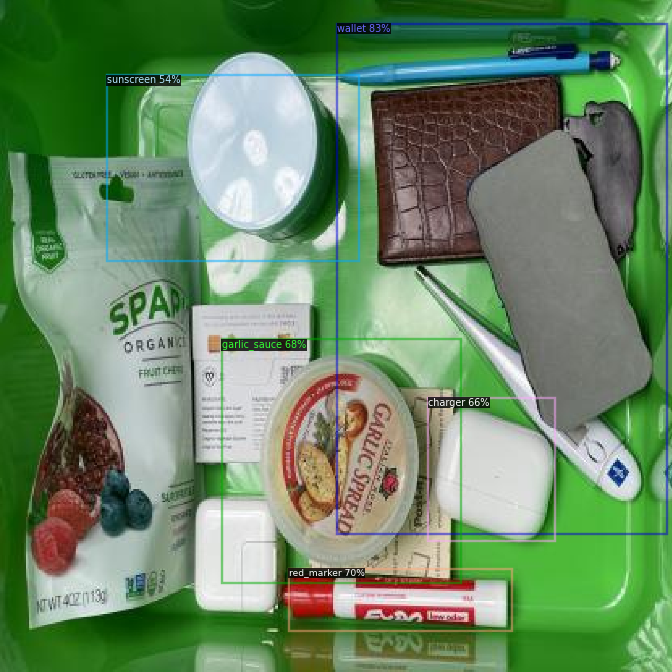

# Semester_project
## Final Report
1.How much occlusion can be present on a single object yet still result in a positive high confidence match?
2.Is the approach scalable to large databases? If so, how can we test this?
3.Could the approach extend to classes of objects or even novel objects?

a) A description of the solution with justification of the applied methods and models. Try to make these justifications through the lens of the questions listed above.

In this occluded-object-detection project I tried to mimic the overlapping issue by applying data augmentation then forward as input to Faster RCNN model for detecting. The performance is evaluated by using Average Precision with each class and mean Average Precision for overall performance.

For experiment, I used raw individual object for training, and the performance was poor as expected.

### randomly partial coarse-dropout
Hence I tried to apply a randomly partial coarse-dropout method to simulate the overlapping scenarios. The performance was worse than output from the raw input. The main issue with this method was that the dropout areas were filled with color Black, and these areas were considered as noise by the Faster RCNN model.

### randomly partial pooling
Hence instead of filling black with the areas, I tried the randomly partial pooling(blurring) method to mitigate this issue. The performance was better than randomly coarse-dropout but still worse than raw input.

### randomly jigsaw
Instead of introducing noise to the model from augmentation, I thought about altering the objects shape to let the model learn from its texture instead of its shape, hence I applied jigsaw method and was expecting some improvements. However, I was too naive.

### Comparison

A sample of occlusion

b) A description of experiments you have conducted and what you hoped to answer by doing these calculations. For instance, if you wanted to test if your solution generalizes across sensors, how you split your data? Or, if you wanted to test different lighting conditions, what samples were selected for training and validation sets? Look at the questions above and think if your experiments allow to answer all of them (or most of them). 

For training: I took individual images with all perspectives (back-, front-, side-view), and applied methods that simulated the occlusion scenarios. Only these images are regarded as training set.
For validation/test: I splited the tote images into 1:1 for val:test.  

The data augmentation for simulation was not an improvement in my case(more like a noise sadly). By eyeballing the detection performance, this method with RCNN can detect an object at most 50 percent being occluded.

c) A detection accuracy achieved on your validation subset (not used in training). You are free to choose an accuracy metric. It can be as simple as IoU, or as complex as mAP. Justify why you decided to use this (and not the other) accuracy metric. 

It was shown in Qa, and the mAP was straightforward and more reasonable over IoU since there were multi-class in this project. If there was only one class in a image, IoU can be better a simple solution.

d) Discuss improvements that could be done if you had more time.  
I tried to mimic the occlusion scenarios and so far the augmentation seems to be considered as noise to the model. Here are some of my ideas with its improvement:
d-1 - The universal way: More training images. My individual images are relatively low, and increasing more images will defintely help.
d-2 - Random zoom: To human, we only need a part of the object to make a prediction in occluded situation, hence the idea of random zoom for training might work. 
d-3 - Split some tote images into training set: This will definitely improve the performance, however, I tried to avoid this due to the leakage information from val/test to train set.  

2. Current version of your programs with instructions how to run them (as in the mid-term delivery).  
2a) For data augmentation: download /dataset/Occluded_final.zip file  
2b) Run the /src/dataaug.ipynb file to get a Occluded_final.zip file(with train_copy folder containing data augmentation in it)  
2c) Open Collab and manually upload the zip file we got from 2b: https://colab.research.google.com/drive/1HQvaEIfyLB3pqp5bcz3M43IQxLbmmMRl?usp=sharing  
2d) click Run ALL and wait for the result (it takes about 20 minutes to train on average, depending on which augmentation and how many images you generated)  

3. Your consent to forward your (a) report and/or (b) sources code along with (c) my short commentary to Amazon Robotics (Tye Brady's team). 

Yes, I would love to!

4. Only for students working in groups: Indicate in the report which part was done by which teammate, as in Computer Vision I class.

## Midterm report
In my work, I applied Faster RCNN architecture to my dataset.

From my understanding, we should have at least 10+ images with different angles of the individual objects. So in my case for 10 classes it should be at least 100 pictures. Data augmentation is a method to provide robustness such as shear, rotation, and exposure. Basically the more quantities and diversity of each object in the training set, the better performance it will have. In my case, I have originial 204 pictures in total for individual objects, and with shear/exposure, I have 494 train images. As for my validation and test dataset, I utilized tote images and splited them in to 1:1 (82:81). The overall actual spliting-frame rate is 494:82:81.
Based on my mAP performance now, it implys that the training images are not enough.

This is a training set visualization:

B) I ran experiemnts on Yolov5 and Faster Rcnn with the tote images in test dataset. For Yolov5 the mAP was always at 0 with different epochs and model widths; on the other hand, Faster Rcnn model did converge and return some results when I set epochs = 1500. As mentioned above, individual objects are selected as training sets with top/side views and top/side/ambient light sources. Ideally it should be providing good performance since this is a non-occluded testing set with the same top/side views and top/side/ambient light sources but with all in the tote.

C&D) Here I used mAP since it provide both false potivie and true positive feedback (also mAP is based on top of IoU). Here my best performance I get 0.227 at mAP_50. My best observation for this low performance is that I noticed that the augmentation didn't take bounding boxes into consideration, so the IoU effects the results. Some solutions I have come up with:
1.fixed the bounding box so it follows the flow of data augmentation. 
2.fine-tuning more hyperparameters such as learning rate to see if I can improve the mAP performance.
3.work on more data-augmentation to increase my trainning dataset, especially start to crop out a small to midium portion of the individual objects as if it was occluded.

2. Current version of your programs with instructions how to run them.

Val_visualization:

 
It is modified from our CV2-MaskRCnn Colab hw. I change the model to FasterRCnn and trained it with my dataset. 
!Action required!
The only two steps is to upload the zip file in this github ./dataset/zipfile to the google calab and restart the runtime after the executing the second cell for the first time.
Please click https://colab.research.google.com/drive/1HQvaEIfyLB3pqp5bcz3M43IQxLbmmMRl?usp=sharing or check your ND email to access the file.

3. Only for students working in groups:

So far Me and Nick are working on our own version of model, and based on our works we will make a fusion version to improve the performance.

