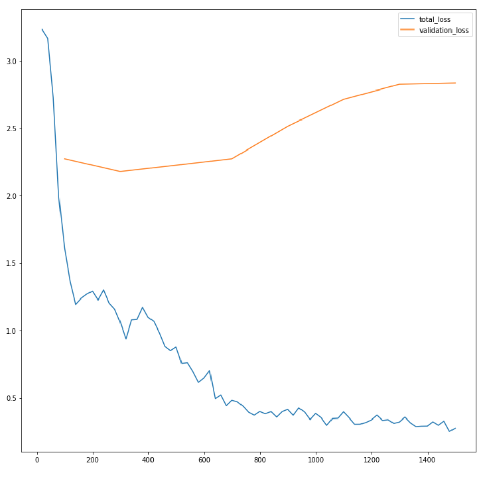

# semester_project

In my work, I have applied Faster RCNN architecture to my dataset.

From my understanding, we should have at least 10+ images with different angles of the individual objects. So in my case for 10 classes it should be at least 100 pictures. Data augmentation is a method to provide robustness such as shear, rotation, and exposure. Basically the more quantities and diversity of each object in the training set, the better performance it will have. In my case, I have originial 204 pictures in total for individual objects, and with shear/exposure, I have 494 train images. As for my validation and test dataset, I utilized tote images and splited them in to 1:1 (82:81). The overall actual spliting frames is 494:82:81.
Based on my mAP performance now, it implys that the training images are not enough.

B) I ran experiemnts on Yolov5 and Faster Rcnn with the tote images in test dataset. For Yolov5 the mAP was always at 0 with different epochs and model widths; on the other hand, Faster Rcnn model did converge and return some results when I set epochs = 1500. As mentioned above, individual objects are selected as training sets with top/side views and top/side/ambient light sources. Ideally it should be providing good performance since this is a non-occluded testing set with the same top/side views and top/side/ambient light sources but with all in the tote.

C&D) Here I used mAP since it provide both false potivie and true positive feedback (also mAP is based on top of IoU). Here my best performance I get 0.227 at mAP_50. My best observation for this low performance is that I noticed that the augmentation didn't take bounding boxes into consideration, so the IoU effects the results. Some solutions I have come up with:
1.fixed the bounding box so it follows the flow of data augmentation. 
2.fine-tuning more hyperparameters such as learning rate to see if I can improve the mAP performance.
3.work on more data-augmentation to increase my trainning dataset, especially start to crop out a small to midium portion of the individual objects as if it was occluded.

2. Current version of your programs with instructions how to run them.

Your program(s) should pick one picture of the tote from the validation set (please attach this sample to your codes) and present the processing result. We should be able to run your programs without any edits -- please double check before submission that the codes are complete and run correctly. Please provide detailed instructions in your report how to run the codes: which version of Python you use, which packages we need to install (attaching the dependency file is a nice thing to do), etc.

Val_visualization:

 
It is modified from our CV2-MaskRCnn Colab hw. I change the model to FasterRCnn and trained it with my dataset. 
Please click https://colab.research.google.com/drive/1HQvaEIfyLB3pqp5bcz3M43IQxLbmmMRl?usp=sharing or check your ND email to access the file.

3. Only for students working in groups:

So far Me and Nick are working on our own version of model, and based on our works we will make a fusion version to improve the performance.

